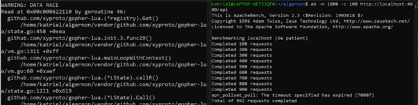

# CVE-2026-43981 — Race Condition in handle() Shared LState (Denial of Service)

## Summary

In Algernon's `handle()` Lua global, a `sync.RWMutex` is released before `L.Push()` and `L.PCall()` execute, leaving both calls completely unprotected. Because gopher-lua's `LState` is explicitly not goroutine-safe, two concurrent HTTP requests to the same handler race on the same Lua state, corrupting the Lua VM's internal stack. Under modest load the Go race detector fires immediately, and a portion of requests start timing out — taking the server down with no special exploit or credentials needed.

---

## Metadata

| Field             | Value                                                                 |
|-------------------|-----------------------------------------------------------------------|
| CVE ID            | CVE-2026-43981                                                        |
| GHSA ID           | GHSA-rr2f-4wrm-h6rg                                                   |
| Severity          | **High**                                                              |
| CVSS v3.1 Score   | 7.5 — `AV:N/AC:L/PR:N/UI:N/S:U/C:N/I:N/A:H`                         |
| CWE               | CWE-362: Concurrent Execution Using Shared Resource with Improper Synchronization (Race Condition) |
| Affected Versions | `< 1.17.6`                                                            |
| Patched Version   | `1.17.6`                                                              |
| Affected Repo     | [xyproto/algernon](https://github.com/xyproto/algernon)               |
| Report Date       | 19 April 2026                                                         |
| Publish Date      | 5 May 2026                                                            |

---

## Vulnerability Details

### Root Cause

In `engine/luahandler.go`, `LoadLuaHandlerFunctions` registers a `handle(path, func)` global that Lua config scripts use to attach HTTP handlers. When a request comes in, the `wrappedHandleFunc` closure acquires a `sync.RWMutex`, calls `LoadCommonFunctions`, then releases the lock — and only after that does it call `L.Push(handleFunc)` and `L.PCall()`. Those two lines run with no lock held at all.

The problem is that `L` — the gopher-lua `LState` — is shared across every request that hits the same handler. The gopher-lua documentation is explicit: `LState` is not goroutine-safe. So the moment two requests arrive concurrently, both goroutines operate on the same Lua stack simultaneously, corrupting the VM's internals.

Worth noting: there was already a `TODO` comment at line 23 of the same file acknowledging the issue and even pointing toward the right fix (`luapool`). The bug was known, just never acted on.

### Affected File

`engine/luahandler.go`, lines 17–43

### Vulnerable Code

```go
func (ac *Config) LoadLuaHandlerFunctions(L *lua.LState, ...) {
    luahandlermutex := &sync.RWMutex{}
    L.SetGlobal("handle", L.NewFunction(func(L *lua.LState) int {
        handleFunc := L.ToFunction(2)
        wrappedHandleFunc := func(w http.ResponseWriter, req *http.Request) {
            luahandlermutex.Lock()
            ac.LoadCommonFunctions(w, req, filename, L, nil, httpStatus)
            luahandlermutex.Unlock() // ← lock dropped here

            // L is still shared. Both lines below are data races:
            L.Push(handleFunc)                                    // ← no lock
            if err := L.PCall(0, lua.MultRet, nil); err != nil { // ← no lock
                logrus.Error("Handler failed:", err)
            }
        }
        mux.HandleFunc(handlePath, wrappedHandleFunc)
        return 0
    }))
}

// TODO at line 23 — developer-acknowledged, never fixed:
// TODO: Set up a channel and function for retrieving a lua "handleFunc"
// and running it, using the common luapool as needed
```

---

## Proof of Concept

Built with the Go race detector enabled:

```bash
go build -race -mod=vendor -o algernon-race .
```

Handler in `serverconf.lua`:

```lua
handle("/api", function()
    content("text/plain")
    local sum = 0
    for i = 1, 50000 do sum = sum + i end
    print("result: " .. sum)
end)
```

Trigger the race with concurrent load:

```bash
ab -n 1000 -c 100 http://localhost:4000/api
```

Race detector output on the server:

```
WARNING: DATA RACE
Read at 0x00c0000622110 by goroutine 46:
  github.com/xyproto/gopher-lua.(*registry).Get()
      .../vendor/github.com/xyproto/gopher-lua/state.go:458
  github.com/xyproto/gopher-lua.mainLoopWithContext()
      .../vendor/github.com/xyproto/gopher-lua/vm.go:60
  github.com/xyproto/gopher-lua.(*LState).callR()
      .../vendor/github.com/xyproto/gopher-lua/state.go:1211
```

Of the 1000 requests sent, 992 completed and 8 timed out — showing the server degrading under load that any browser or basic HTTP client would generate.



---

## Impact

Any unauthenticated client sending concurrent requests to a `handle()`-registered path can trigger this. No credentials, no session, no special payload — just normal HTTP concurrency.

Denial of service is the primary outcome. Lua VM corruption causes the server to start dropping requests under load. In testing, 100 concurrent clients was enough to trigger it reliably.

Beyond availability, a corrupted shared Lua stack can cause handlers to skip logic, return wrong data, or execute the wrong function — so there's a secondary risk of incorrect responses or data leaking between concurrent requests.

---

## Fix

Fixed in `v1.17.6` by [xyproto](https://github.com/xyproto) via commit [`ddb7896`](https://github.com/xyproto/algernon/commit/ddb7896eb33aac08a3e6bb42bd1add5ccaa877bf), resolving issue #172.

The fix goes further than just swapping in the existing `luapool`. A dedicated `handlerPool` type was introduced in a new file (`engine/handlerpool.go`) — a bounded pool of independent `LState` instances backed by a buffered channel. The channel gives natural backpressure: if all states are busy, `Get()` blocks until one is returned. Pool size defaults to `runtime.NumCPU()`.

On startup, `buildHandlerPool()` creates one fresh Lua state per CPU, re-runs the config script on each (with server-side setup functions replaced by no-ops so nothing fires twice), and stores each state in the pool. Each state ends up with its own independent copy of every `handle()` function in its Lua registry, keyed by path. At request time the handler borrows a state, looks up the right function by path, runs it, then returns the state via `defer`. The shared `L` capture and the `sync.RWMutex` are removed entirely.

**Before** (`engine/luahandler.go`):

```go
// sync.RWMutex in use, shared L captured across all requests
luahandlermutex := &sync.RWMutex{}

wrappedHandleFunc := func(w http.ResponseWriter, req *http.Request) {
    luahandlermutex.Lock()
    ac.LoadCommonFunctions(w, req, filename, L, nil, httpStatus)
    luahandlermutex.Unlock() // lock dropped before Push/PCall

    L.Push(handleFunc)                                    // data race
    if err := L.PCall(0, lua.MultRet, nil); err != nil { // data race
        logrus.Error("Handler for "+handlePath+" failed:", err)
    }
}
```

**After** (`engine/luahandler.go`):

```go
// sync import removed entirely. Each request borrows its own isolated state.
wrappedHandleFunc := func(w http.ResponseWriter, req *http.Request) {
    poolL := ac.handlerPool.Get()
    defer ac.handlerPool.Put(poolL)

    fn := poolL.G.Registry.RawGetString(handleRegistryPrefix + handlePath)
    handlerFn, ok := fn.(*lua.LFunction)
    if !ok {
        logrus.Error("Handler for " + handlePath + " is missing from the pool state")
        return
    }

    ac.LoadCommonFunctions(w, req, filename, poolL, nil, httpStatus)
    poolL.Push(handlerFn)
    if err := poolL.PCall(0, lua.MultRet, nil); err != nil {
        logrus.Error("Handler for "+handlePath+" failed:", err)
    }
}
```

**New file** (`engine/handlerpool.go`):

```go
// handlerPool is a bounded pool of Lua states used to serve handle()
// requests. A buffered channel provides Get/Put with natural backpressure:
// if all states are busy, Get blocks until one is returned.
type handlerPool struct {
    ch     chan *lua.LState
    states []*lua.LState
}

func (p *handlerPool) Get() *lua.LState  { return <-p.ch }
func (p *handlerPool) Put(L *lua.LState) { p.ch <- L }
```

The `TODO` comment that had been sitting at line 23 since before the report was removed and replaced with the actual implementation.

---

## Timeline

- **19 April 2026** — Vulnerability discovered and privately reported to xyproto via `xyproto@archlinux.org` per SECURITY.md
- **22 April 2026** — Fix merged, commit [`ddb7896`](https://github.com/xyproto/algernon/commit/ddb7896eb33aac08a3e6bb42bd1add5ccaa877bf)
- **Pre-1.17.6** — CVE-2026-43981 assigned
- **5 May 2026** — Advisory published (GHSA-rr2f-4wrm-h6rg, this writeup)

---

## References

- [GHSA-rr2f-4wrm-h6rg](https://github.com/xyproto/algernon/security/advisories/GHSA-rr2f-4wrm-h6rg)
- [Fix — commit ddb7896](https://github.com/xyproto/algernon/commit/ddb7896eb33aac08a3e6bb42bd1add5ccaa877bf)
- [CVE-2026-43981 on MITRE](https://cve.mitre.org/cgi-bin/cvename.cgi?name=CVE-2026-43981)
- [xyproto/algernon](https://github.com/xyproto/algernon)