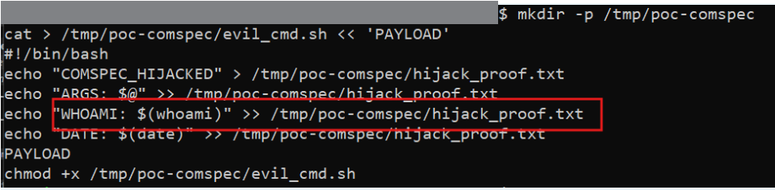
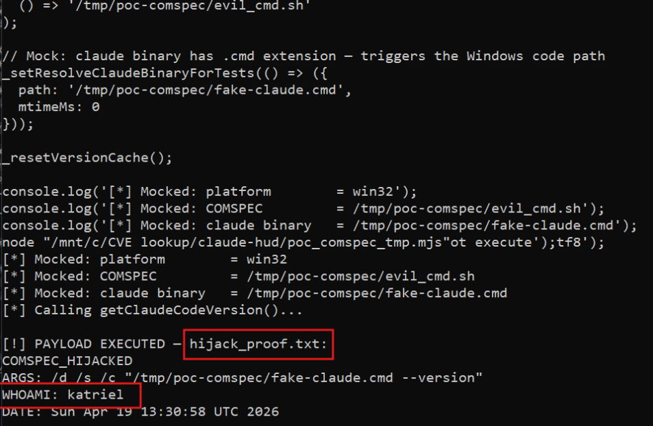
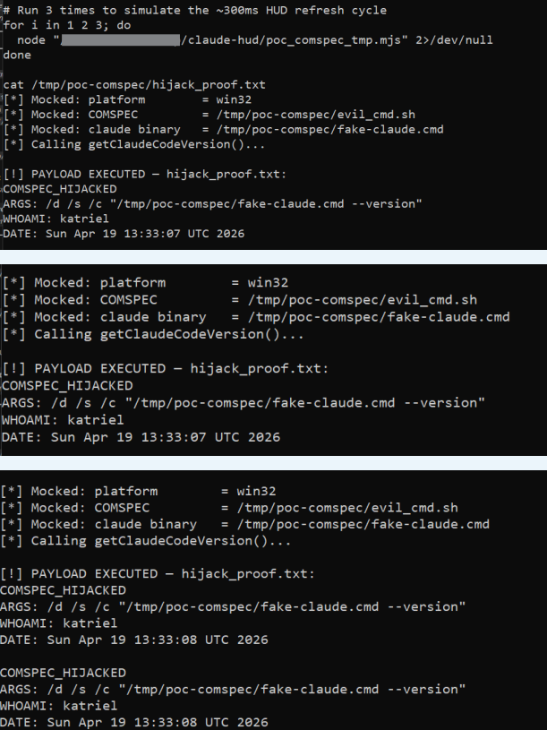

# CVE-2026-47092 — Arbitrary Command Execution via COMSPEC Environment Variable (Windows)

## Summary

On Windows, claude-hud reads the `COMSPEC` environment variable and passes it without any validation as the `file` argument to `execFile()` when invoking Claude Code's version check. Since any process that runs before claude-hud can set `COMSPEC` to an arbitrary binary path, an attacker with local code execution (for example via a malicious npm package's `postinstall` script) can redirect this call to their own binary. The HUD executes it on every startup, renders completely normally, and gives no indication anything went wrong.

---

## Metadata

| Field             | Value                                                                 |
|-------------------|-----------------------------------------------------------------------|
| CVE ID            | CVE-2026-47092                                                        |
| GHSA ID           | N/A (assigned by VulnCheck)                                           |
| Severity          | **High**                                                              |
| CVSS v4 Score     | 7.3 — `CVSS:4.0/AV:L/AC:L/AT:P/PR:L/UI:N/VC:H/VI:H/VA:H/SC:N/SI:N/SA:N` |
| CWE               | CWE-427: Uncontrolled Search Path Element                             |
| Affected Versions | `<= 0.0.12`                                                           |
| Patched Version   | commit `234d9aa` (post-0.0.12)                                        |
| Affected Repo     | [jarrodwatts/claude-hud](https://github.com/jarrodwatts/claude-hud)  |
| Report Date       | 19 April 2026                                                         |
| Publish Date      | 18 May 2026                                                           |

---

## Vulnerability Details

### Root Cause

In `src/version.ts`, `_getClaudeVersionInvocation()` builds the command used to run the Claude Code version check. On Windows, when the Claude binary has a `.cmd` or `.bat` extension (which is the default for npm-installed packages), it uses `execFile()` with `COMSPEC` as the executable path. The value is read directly from the environment with no validation — no check that it's an absolute path, no check that the filename ends in `cmd.exe`, nothing:

```typescript
// version.ts:43 — COMSPEC read raw from environment
let comspecImpl: () => string | undefined = () => process.env.COMSPEC;

// version.ts:205-209 — used directly as the execFile() target
export function _getClaudeVersionInvocation(...): ClaudeVersionInvocation {
  if (platform === 'win32' && (ext === '.cmd' || ext === '.bat')) {
    return {
      file: comspec || 'cmd.exe', // ← attacker-controlled binary path
      args: ['/d', '/s', '/c', `"${command}"`],
    };
  }
}

// version.ts:254 — executed via execFile()
const { stdout } = await execFileImpl(invocation.file, invocation.args, {...});
```

The fallback `'cmd.exe'` only applies when `COMSPEC` is empty or undefined. An attacker sets it to a non-empty malicious path, which bypasses the fallback entirely.

Trigger conditions on a standard Windows Claude Code installation: platform is `win32`, Claude binary is `claude.cmd` (npm default), and `showClaudeCodeVersion` is enabled (default).

### Affected File

`src/version.ts`, line 43 (source), line 205 (sink)

### Vulnerable Code

```typescript
// Before — COMSPEC trusted from environment without validation
let comspecImpl: () => string | undefined = () => process.env.COMSPEC;

// _getClaudeVersionInvocation — attacker controls the file argument
return {
  file: comspec || 'cmd.exe',
  args: ['/d', '/s', '/c', `"${command}"`],
};
```

---

## Proof of Concept

**Function-level proof** — mock COMSPEC to an attacker binary and confirm it becomes the `execFile()` target:

```javascript
// poc_comspec_tmp.mjs
import { _getClaudeVersionInvocation, _setVersionInvocationEnvForTests,
         _setResolveClaudeBinaryForTests } from '/path/to/claude-hud/dist/version.js';

_setVersionInvocationEnvForTests(
  () => 'win32',
  () => '/tmp/poc-comspec/evil_cmd.sh'
);
_setResolveClaudeBinaryForTests(() => ({
  path: '/tmp/poc-comspec/fake-claude.cmd',
  mtimeMs: 0
}));

console.log('[*] Mocked: platform    = win32');
console.log('[*] Mocked: COMSPEC     = /tmp/poc-comspec/evil_cmd.sh');
console.log('[*] Calling getClaudeCodeVersion()...');
```

The attacker binary receives the real cmd.exe argument structure (`/d /s /c "claude.cmd --version"`) and can do whatever it wants before optionally forwarding to the real `cmd.exe` to suppress errors.







**Real-world attack chain:**

1. Attacker publishes npm package with `postinstall` script:
   ```bat
   setx COMSPEC C:\Users\victim\AppData\Local\Temp\evil.cmd
   ```
2. User installs the package — `COMSPEC` is now set to the attacker binary
3. User opens Claude Code with claude-hud as statusline
4. claude-hud calls `_getClaudeVersionInvocation('claude.cmd', 'win32', 'C:\...\evil.cmd')`
5. `execFile('C:\...\evil.cmd', ['/d', '/s', '/c', '"claude.cmd --version"'])` fires
6. Attacker binary exfiltrates `%USERPROFILE%\.anthropic\api_key`, installs persistence via a registry Run key, then calls real `cmd.exe` to suppress all visible errors

---

## Impact

Windows users running claude-hud with Claude Code installed via npm are at risk. Any process that runs before claude-hud can poison `COMSPEC` — this includes malicious npm packages, other installed tooling, or any local attacker who can write environment variables. Once set, the attacker binary executes every time claude-hud performs its version check, with the same privileges as the user running Claude Code. The HUD renders normally throughout, so the user has no indication anything is wrong.

---

## Fix

Fixed in commit [`234d9aa`](https://github.com/jarrodwatts/claude-hud/commit/234d9aad919b51326a43bcf90b45ae35c23afc30) by [jarrodwatts](https://github.com/jarrodwatts), PR [#487](https://github.com/jarrodwatts/claude-hud/pull/487).

`COMSPEC` is no longer read from the environment at all. The implementation now uses a hardcoded path to the Windows system `cmd.exe`, derived from the `SystemRoot` environment variable which is set by Windows itself and is far harder to poison than `COMSPEC`:

```typescript
// Before — COMSPEC trusted from user environment
let comspecImpl: () => string | undefined = () => process.env.COMSPEC;

// _getClaudeVersionInvocation — attacker-controlled
file: comspec || 'cmd.exe'

// After — hardcoded safe path, COMSPEC ignored entirely
let windowsCmdImpl: () => string = () => 'C:\\Windows\\System32\\cmd.exe';

// _getClaudeVersionInvocation — fixed path, no environment input
file: windowsCmd  // always 'C:\\Windows\\System32\\cmd.exe'
```

A dedicated test was also added to confirm that even if `COMSPEC` is set to a malicious value, the invocation still uses the hardcoded safe path:

```javascript
test('_getClaudeVersionInvocation ignores COMSPEC on Windows', () => {
  process.env.COMSPEC = 'C:\\malicious\\cmd.exe';
  const invocation = _getClaudeVersionInvocation(
    'C:\\Program Files\\Claude\\claude.cmd', 'win32'
  );
  assert.equal(invocation.file, 'C:\\Windows\\System32\\cmd.exe');
});
```

---

## Timeline

- **19 April 2026** — Vulnerability discovered and privately reported to jarrodwatts
- **22 April 2026** — Fix merged, commit [`234d9aa`](https://github.com/jarrodwatts/claude-hud/commit/234d9aad919b51326a43bcf90b45ae35c23afc30), PR [#487](https://github.com/jarrodwatts/claude-hud/pull/487)
- **18 May 2026** — CVE-2026-47092 published by VulnCheck

---

## References

- [VulnCheck Advisory](https://www.vulncheck.com/advisories/claude-hud-arbitrary-command-execution-via-comspec-environment-variable)
- [GitHub Issue #485](https://github.com/jarrodwatts/claude-hud/issues/485)
- [Fix — PR #487](https://github.com/jarrodwatts/claude-hud/pull/487)
- [Fix — commit 234d9aa](https://github.com/jarrodwatts/claude-hud/commit/234d9aad919b51326a43bcf90b45ae35c23afc30)
- [CVE-2026-47092 on MITRE](https://cve.mitre.org/cgi-bin/cvename.cgi?name=CVE-2026-47092)
- [jarrodwatts/claude-hud](https://github.com/jarrodwatts/claude-hud)